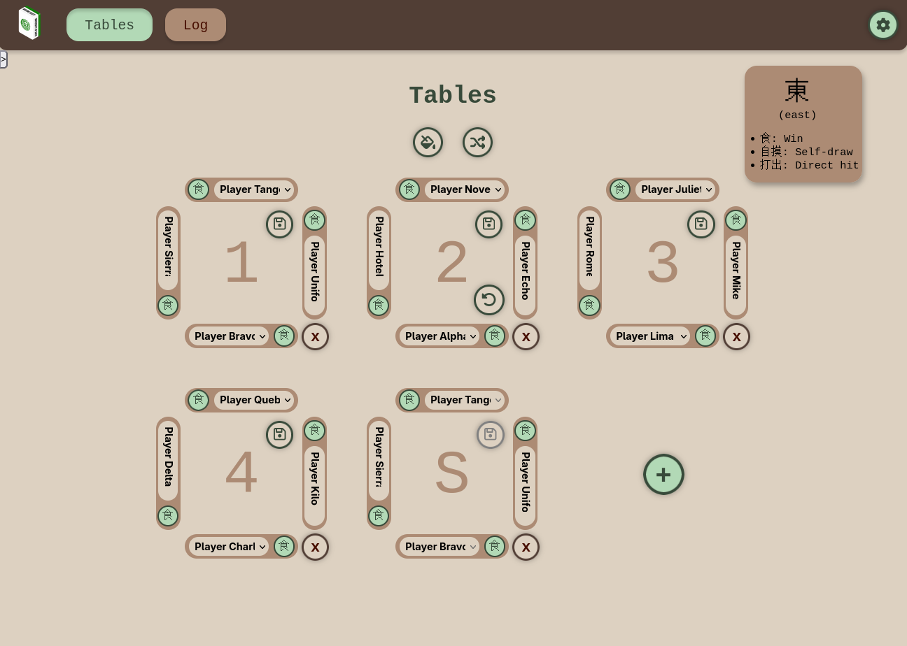

A webserver for hosting scored Mahjong games. Used for a society Mahjong
tournament (seating players, recording scores, etc.).

 

 

- interactive client frontend (`client`)
- sqlite3 persistent storage
- hashed password with cookie sessions
- (not currently used) QR code generation for login
- (not currently used) connected to Google Sheets API

# Setup

See [docs/SETUP.md](./docs/SETUP.md)

# Development

See [docs/DEVELOPMENT.md](./docs/DEVELOPMENT.md)
